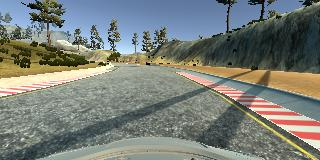

# **Behavioral Cloning**

[Exported Jupyter notebook](https://jefflirion.github.io/udacity_car_nanodegree_project03/Behavioral_Cloning.html)

--------------

## From Udacity:

> The goals / steps of this project are the following:
>
> * Use the simulator to collect data of good driving behavior
> * Build a convolution neural network in Keras that predicts steering angles from images
> * Train and validate the model with a training and validation set
> * Test that the model successfully drives around track one without leaving the road
> * Summarize the results with a written report
>
>
>
> ### Rubric Points
>
> Here I will consider the [rubric points](https://review.udacity.com/#!/rubrics/432/view) individually and describe how I addressed each point in my implementation.  
>
>
>
> ### Files Submitted & Code Quality
>
> #### 1. Submission includes all required files and can be used to run the simulator in autonomous mode
>
> My project includes the following files:
>
> * [model.py](https://jefflirion.github.io/udacity_car_nanodegree_project03/model.py) containing the script to create and train the model
> * [drive.py](https://jefflirion.github.io/udacity_car_nanodegree_project03/drive.py) for driving the car in autonomous mode
> * [model.h5](https://jefflirion.github.io/udacity_car_nanodegree_project03/model.h5) containing a trained convolution neural network
> * ~~writeup_report.md or writeup_report.pdf~~ [README.md](https://jefflirion.github.io/udacity_car_nanodegree_project03/README.md) summarizing the results
>
> #### 2. Submission includes functional code
>
> Using the Udacity provided simulator and my [drive.py](https://jefflirion.github.io/udacity_car_nanodegree_project03/drive.py) file, the car can be driven autonomously around the track by executing
>
> ```sh
> python drive.py model.h5
> ```
>
> #### 3. Submission code is usable and readable
>
> The [model.py](https://jefflirion.github.io/udacity_car_nanodegree_project03/model.py) file contains the code for training and saving the convolution neural network. The file shows the pipeline I used for training and validating the model, and it contains comments to explain how the code works.
>
>
>
> ### Model Architecture and Training Strategy
>
> #### 1. An appropriate model architecture has been employed

My model consists of a convolution neural network with 5x5 and 3x3 filter sizes and depths between 24 and 64.  The images are cropped and normalized in the model using a Keras Cropping2D layer and Lambda layer, respectively.

> #### 2. Attempts to reduce overfitting in the model
>
> The model contains dropout layers in order to reduce overfitting.
>
> The model was trained and validated on different data sets to ensure that the model was not overfitting. The model was tested by running it through the simulator and ensuring that the vehicle could stay on the track.
>
> #### 3. Model parameter tuning
>
> The model used an adam optimizer, so the learning rate was not tuned manually.
>
> #### 4. Appropriate training data
>
> Training data was chosen to keep the vehicle driving on the road. I used a combination of center lane driving and recovering from the left and right sides of the road.  

 For details about how I created the training data, see the next section.

--------------

## Model Architecture and Training Strategy

### 1. Solution Design Approach

Here is the overall strategy that I followed for this project.  

1. **Record data and successfully train a model.**  The goal of this step was simply to learn how to work with the data.  The steps taken were:

  * Record a very small amount of training data (about 10 seconds worth).
  * Train and save a very simple model based on this data.  

2. **Record more data and successfully train a model using 2 input datasets.**

  * Record another small amount of training data.
  * Train and save a very simple model based on this data and the previously recorded data.

3. **Pre-process the data.**

  * Load the right and left camera images and correct for the steering angles.
  * Horizontally flip all of the images and negate the steering angles.
  * Divide each recorded dataset into its constituent recordings.
  * Implement a moving average to smooth the steering measurements.
  * Implement an option to load the data as numpy arrays or load it using a generator.

4. **Record additional data and load it using a generator.**

  * Record 3 full loops around the track.  
  * Record approximately 1 full loop in which I recover the car from being too far to the right.
  * Record approximately 1 full loop in which I recover the car from being too far to the left.
  * Implement the option to load the data using a generator.  

5. **Improve the model.**

  * Crop the images.
  * Normalize the images.
  * Modify the model.


My first goal was simply to successfully train a model, so for this step I used a single fully connected layer (`Flatten` followed by `Dense`).  When it was time to improve the model, in the spirit of transfer learning I started off with the model that performed best in the "Behavioral Cloning" videos; specifically, I started with the NVIDIA autonomous driving model, as presented in video #14.  This performed really well, but it still needed some improvement.  

The data itself is a critical aspect of this problem, but I will discuss that more in section "3. Creation of the Training Set & Training Process."

When training the model, I split the data into a training set (80%) and a validation set (20%), and I trained the model for 20 epochs.  The training loss decreased on most of the epochs, while the validation loss only decreased a little bit at the start and then stabilized.  That said, the validation loss was still small and of the same magnitude as the mean squared error on the training set, so this did not concern me.  Besides, there's room for some variation when driving -- maybe one driver tends to drift to one side of the lane, or another driver might continuously make small corrections in order to stay in the center.  Therefore, I placed more importance on the actual performance of the model in the simulator than on its mean squared error.  

Initially, the NVIDIA-based model struggled around some of the sharper turns.  Admittedly, I struggled on these portions of the track, so it should come as no surprise that the model struggled, as well!  To combat this, I added some additional training data and utilized dropout, and the revised model was able to drive the vehicle around the track without leaving the road.  


### 2. Final Model Architecture

The final model architecture (see the function `create_model` in [model.py](https://jefflirion.github.io/udacity_car_nanodegree_project03/model.py)) consisted of some image pre-processing (cropping and normalization) followed by 4 convolution layers and then 3 fully-connected layers.  Here is a visualization of the model:


### 3. Creation of the Training Set & Training Process

I started off by trying to capture ideal driving behavior, meaning driving in the center of the lane.  Here is a representative image:


I then recorded the vehicle recovering from the left side and right sides of the road back to center so that the vehicle would learn to correct itself when it veered away from the center of the road.  These images show a recovery from the right side of the road to the center:





To augment the data, I also flipped images and angles so that the model has equal amounts of data in which the car is turning left and right.  An alternative approach would have been to drive around the track in the opposite direction, but this was easier and accomplished the same thing.  Here is an example of a flipped image:


In the videos, it was said that using the mouse yields the best training data.  However, I was using the simulator on a laptop and using the mouse was really difficult, so I used the keys instead.  Since a key is a binary input -- either it's pressed or it's not -- this resulted in my turns being a sequence of frequent button presses rather than a steady turn.  In order to improve the quality of the training data, I applied a moving average filter so that each steering angle was actually the average of itself and the 5 measurements before and afterwards (so it was the average of a total of 11 measurements).  

I also included the left and right camera images, using a correction factor of 0.2 to adjust their associated steering measurements from the recorded steering measurement.  

I cropped 70 pixels from the top of the images and 25 pixels from the bottom, as demonstrated in the project videos.  

After all of the pre-processing was done, I had a training set with 44,904 images and associated steering angles.  I shuffled the dataset and used 80% for training and 20% for validation.  As discussed above, I ran the model for 20 epochs.  I used an adam optimizer so that manually training the learning rate wasn't necessary.

I trained the model using the following code:

```bash
export KERAS_BACKEND=tensorflow
export datadir=../../Projects/Project_03/data

export drives=$datadir/drive0:$datadir/drive1:$datadir/drive2:$datadir/drive3
export drives=$drives:$datadir/recover_right1:$datadir/recover_right2:$datadir/recover_right3
export drives=$drives:$datadir/recover_left1:$datadir/recover_left2
export drives=$drives:$datadir/bobbie2

python ../../Projects/Project_03/model.py --drives $drives --convolve 11 --correction 0.2 --epochs 20
```


## Video

A video of the car driving autonomously for one lap can be found [here](https://jefflirion.github.io/udacity_car_nanodegree_project03/video.mp4).
